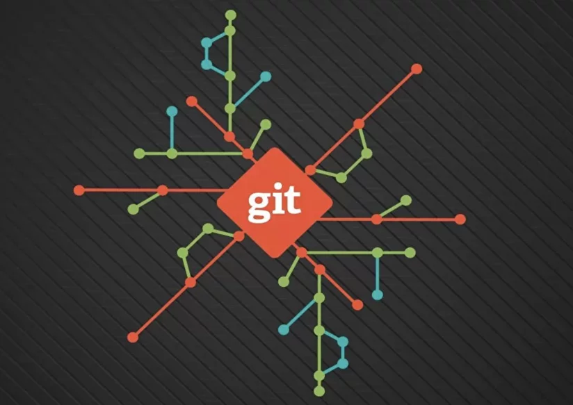
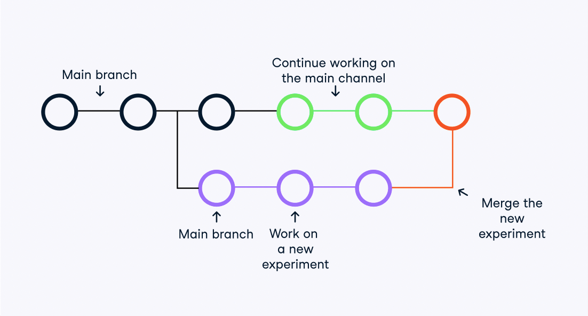

 # 1.Что такое GIT
### **Git это консольная утилита для отслеживания изменений файлов в вашем проекте**

Git — абсолютный лидер по популярности среди современных систем управления версиями. Это развитый проект с активной поддержкой и открытым исходным кодом. Система Git была изначально разработана в 2005 году Линусом Торвальдсом — создателем ядра операционной системы Linux. Git применяется для управления версиями в рамках колоссального количества проектов по разработке ПО, как коммерческих, так и с открытым исходным кодом. Система используется множеством профессиональных разработчиков программного обеспечения. Она превосходно работает под управлением различных операционных систем и может применяться со множеством интегрированных сред разработки (IDE).

С помощью **Git** можно откатить проект до более старой версии, сравнивать, анализировать или сливать свои изменения в *репозиторий*

**Репозиторий** это хранилище вашего кода и внесённых изменений.

**Git** работает локально и все ваши репозитории хранятся в определённых папках на жестком диске

**Commit** это каждая точка сохранения вашего проекта. 

# 2.Установка GIT
Для установки Git в Windows.
Официальная сборка доступна для скачивания на официальном сайте Git. Просто перейдите на страницу https://git-scm.com/download/win, и загрузка запустится автоматически. 

Установщик Git для OS X доступен для скачивания с сайта Git 

https://git-scm.com/download/mac.

# 3. Настройка GIT

Вы установили себе Git и можете им пользоваться. Давайте теперь его настроим, чтобы когда вы создавали commit, указывался автор, кто его создал.

Открываем терминал (Linux и MacOS) или консоль (Windows) и вводим следующие команды.

**Установим имя для вашего пользователя**

Кавычки оставляем

**git config --global user.name "<ваше_имя>"**

Теперь установим email. Принцип тот же

**git config --global user.email "<адрес_почты@email.com>"**

# 4. Инициализация

Чтобы создать новый репозиторий, нам нужно открыть терминал, зайти в папку нашего проекта и выполнить команду **git init**

Теперь Git отслеживает изменения файлов вашего проекта. Но, так как вы только создали репозиторий в нем нет вашего кода. Для этого необходимо создать **commit**

## Добавим все файлы проекта в наш будущий commit


**git add** 

**Или так** 

git add --all

*Если хотим добавить конкретный файл то можно так
git add <имя_файла>*


# 5. Запись изменения в репозитории
Теперь создаем commit. Обязательно указываем комментарий.
И не забываем про кавычки
git commit -m "<комментарий>"
Отлично. Вы создали свой первый репозиторий и заполнили его первым commit.

# 6. Определение состояния
**git status** — это еще одна важнейшая команда, которая показывает информацию о текущем состоянии репозитория: актуальна ли информация на нём, нет ли чего-то нового, что поменялось, и так далее. Запуск git status на нашем свежесозданном репозитории должен выдать:

```
$ git status
On branch master
Initial commit
Untracked files:
(use "git add ..." to include in what will be committed)
hello.txt
```

Сообщение говорит о том, что файл hello.txt неотслеживаемый. Это значит, что файл новый и система еще не знает, нужно ли следить за изменениями в файле или его можно просто игнорировать. Для того, чтобы начать отслеживать новый файл, нужно его специальным образом объявить.

# 7. Просмотр истории коммитов
Для просмотра все выполненных фиксаций можно воспользоваться историей коммитов. Она содержит сведения о каждом проведенном коммите проекта. Запросить ее можно при помощи команды:

git log
В ней содержиться вся информация о каждом отдельном коммите, с указанием его хэша, автора, списка изменений и даты, когда они были сделаны. Отследить интересующие вас операции в списке изменений, можно по хэшу коммита, при помощи команды git show :

git show hash_commit
Ну а если вдруг нам нужно переделать commit message и внести туда новый комментарий, можно написать следующую конструкцию:

git commit --amend -m 'Новый комментарий'
В данном случае сообщение последнего коммита перезапишется. Но злоупотреблять этим не стоит, поскольку эта операция опасная и лучше ее делать до отправки коммита на сервер.

# 8. Перемещение между сохранениями
У каждого коммита есть свой уникальный идентификатор в виде строки цифр и букв. Чтобы просмотреть список всех коммитов и их идентификаторов, можно использовать команду log

Идентификаторы довольно длинные, но для работы с ними не обязательно копировать их целиком — первых нескольких символов будет вполне достаточно. Чтобы посмотреть, что нового появилось в коммите, мы можем воспользоваться командой show [номер коммита]
Гит позволяет вернуть выбранный файл к состоянию на момент определенного коммита. Это делается командой checkout [номер коммита]

Чтобы увидеть разницу между двумя коммитами, используется команда diff (с указанием промежутка между коммитами)

$ git diff 09bd8cc..ba25c0ff

# 9. Игнорирование файлов

Если вам необходимо сделать так,чтоб не отслеживались какие то файлы, которые вы не только не хотите автоматически добавлять в репозиторий, но и видеть в списках неотслеживаемых (а чем взрослее проект, тем больше таких файлов может быть). К таким файлам обычно относятся автоматически генерируемые файлы (различные логи, результаты сборки программ и т.п.), то необходимо в репозитории создать файл с названием

**.gitignore**
и в неё добавить все файлы, прописав их названия. Если много однотипных файлов, то можно прописать например *.png или *.jpg и тогда, после сохранения, туда добавятся все файлы с разрешением png и jpg
После этого исменения необходимо закоммитить
# 10. Создание веток в GIT

Почти каждая система контроля версий в какой-то форме поддерживает ветвление. Используя ветвление, вы отклоняетесь от основной линии разработки и продолжаете работу независимо от нее, не вмешиваясь в основную линию.

Ветки нужны для того, чтобы программисты могли вести совместную работу над проектом и не мешать друг другу при этом. При создании проекта, Git создает базовую ветку. Она называется master веткой. Она считается центральной веткой

Просто сделать ветку, не переключаясь на нее можно командой

```
git branch <имя ветки>

переключиться на ветку

git checkout <имя ветки> 
```

Важно понимать, что ветка берет свое начало не от ветки, а от последнего коммита который находиться в той ветке, в которой вы находились.


# 11. Cлияние веток и разрешение конфликтов



Команда git branch — это своего рода “менеджер веток”. Она умеет перечислять ваши ветки, создавать новые, удалять и переименовывать их. Рабочая ветка будет отмечена звёздочкой(*)

`git checkout <имя ветки>`

Команда git checkout используется для переключения веток и выгрузки их содержимого в рабочую директорию.

`git merge <имя ветки>`

Команда git merge используется для слияния одной или нескольких веток в текущую. Затем она устанавливает указатель текущей ветки на результирующий коммит.
Конфликты регулярно возникают при слиянии ветвей или при отправке чужого кода. Иногда конфликты исправляются автоматически, но обычно с этим приходится разбираться вручную — решать, какой код остается, а какой нужно удалить.

# 12. Удаление веток
Итак, вы создали ветку, чтобы работать в ней над какими-то изменениями. Затем вы слили свои изменения в исходную версию проекта.

Это значит, что вам больше не нужна ветка, в которой вы работали над изменениями. Удалить ее будет хорошим тоном: таким образом она не будет мешаться в вашем коде.

Локальные ветки – это ветки на вашем компьютере, которые не влияют на ветки удаленного репозитория.

Команда для удаления локальной ветки в Git:

**git branch -d  local_branch_name**

**git branch** – команда для удаления локальной ветки.
-d – флаг, опция команды git branch, сокращенный вариант записи --delete. Как и следует из названия, предназначен для удаления ветки.

local_branch_name – имя удаляемой ветки.

# 13. Основные команды GIT

# 14. Вспомогательные команды GIT

# 15. Совместная работа с GIT
 # `Работа с GitHub`

 1. Создать аккаунт на GITHUB.com
 2. Создать удалённый репозиторий
 3. GIT выдаст инструкцию, где вы сможете выбрать создать новый локальный репозиторий или привязать уже существующий. Неодбходимо построчно скопировать команды инструкции и вставить их в свой терминал 

```
or create a new repository on the command line

echo "# instruction" >> README.md
git init
git add README.md
git commit -m "first commit"
git branch -M main
git remote add origin <ссылка на удалённый репозиторий>
git push -u origin main
```

```
or push an existing repository from the command line

git remote add origin <ссылка на удалённый репозиторий>
git branch -M main
git push -u origin main
```


